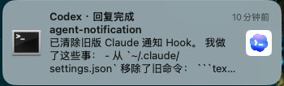
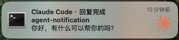

# agent-notify

## 效果图
<p>
  
  
</p>

## 简介
一套同时适配 Claude Code CLI 和 Codex CLI 的 macOS Hook 通知脚本。

## 通知场景

- `Stop`：当前回复完成，通知正文显示 `last_assistant_message` 摘要。
- `PermissionRequest` / `Notification.permission_prompt`：CLI 正在等待用户授权。
- 点击通知：通过 `terminal-notifier -activate` 激活发起任务的终端应用。
- 同一项目同类通知使用稳定 `-group`，新通知替换旧通知。
- 回复完成时自动移除同项目遗留的授权通知。

脚本默认不在锁屏通知中显示待执行命令或 `tool_input`，避免泄露令牌、路径和业务数据。

## 使用方式

### 在线安装

依赖 Python 3。推荐安装 `terminal-notifier`：

```bash
brew install terminal-notifier
curl -fsSL https://raw.githubusercontent.com/MisterZhouZhou/agent-notification/main/install.sh | sh
```

如果访问 `raw.githubusercontent.com` 时出现证书校验或连接错误，请先配置你的本地代理后再执行安装命令：

```bash
export https_proxy=http://127.0.0.1:7897 http_proxy=http://127.0.0.1:7897
curl -fsSL https://raw.githubusercontent.com/MisterZhouZhou/agent-notification/main/install.sh | sh
```

不建议使用 `curl -k` 跳过证书校验；安装脚本会在本机执行，保留 TLS 校验更安全。

默认在线安装会同时配置 Claude Code 和 Codex。只安装其中一个：

```bash
curl -fsSL https://raw.githubusercontent.com/MisterZhouZhou/agent-notification/main/install.sh \
  | sh -s -- --agent codex

curl -fsSL https://raw.githubusercontent.com/MisterZhouZhou/agent-notification/main/install.sh \
  | sh -s -- --agent claude
```

如需从指定分支、tag 或 fork 安装：

```bash
curl -fsSL https://raw.githubusercontent.com/MisterZhouZhou/agent-notification/main/install.sh \
  | sh -s -- --repo MisterZhouZhou/agent-notification --ref main
```

### 本地源码安装

```bash
sh install.sh

# 跳过交互选择，直接指定 Agent CLI
sh install.sh --agent codex
sh install.sh --agent claude
sh install.sh --agent all

# 或者直接运行 Python 安装器
python3 install.py --agent codex
```

本地运行 `sh install.sh` 时会提示选择安装 `Codex`、`Claude` 或 `Both`。在线管道安装无法交互选择，默认安装 `all`，可通过 `--agent codex|claude|all` 指定范围。

安装器会：

1. 将脚本复制到 `~/.local/bin/agent-notify`。
2. 将 Claude Code 和 Codex 的统一 `256×256 RGBA PNG` 图标复制到 `~/.local/share/agent-notify/icons/`。
3. 合并更新 `~/.claude/settings.json`。
4. 合并更新 `~/.codex/hooks.json`。
5. 保留已有配置，重复执行不会重复添加 Hook。

修改已有 JSON 前会在同目录创建带时间戳的 `*.agent-notify-backup-*` 备份，配置通过临时文件原子替换。

安装器如果发现 `notify-on-stop.sh`、`notify-pretty.sh` 等旧通知 Hook，会输出重复通知警告，但不会自动删除用户已有命令。

Claude Code 和 Codex 需要重新启动或新建会话才能加载配置。配置示例位于 `config/`。

### 检查权限

安装后检查 macOS 通知权限：

```bash
~/.local/bin/agent-notify doctor
~/.local/bin/agent-notify doctor --open-settings
```

如果曾在 macOS 中手动关闭 terminal-notifier 的“允许通知”，后续发送仍可能返回成功，但系统不会展示横幅，也不会再次弹出授权框。请使用第二条命令打开“系统设置 → 通知”，手动重新开启。

正常 Hook 运行时如果明确检测到权限已关闭，脚本会改用 AppleScript `display dialog` 弹出引导；点击“打开设置”进入通知设置。该对话框不依赖通知权限，在 Hook 内同步显示并于 8 秒后自动关闭。提醒通过 `~/Library/Caches/agent-notify/permission-reminder.json` 按 `session_id` 去重：同一会话只提示一次，新会话仍会提示；缺少会话 ID 时按 1 小时节流。检测读取 macOS 15 的 `com.apple.ncprefs` 通知启用位，只读不修改系统设置；无法识别未来系统格式时会要求人工确认。设置 `AGENT_NOTIFY_PERMISSION_REMINDER=0` 可关闭该引导。

### 手动测试通知

只检查命令参数，不发送通知：

```bash
AGENT_NOTIFY_DRY_RUN=1 ~/.local/bin/agent-notify codex stop <<< '{"cwd":"/tmp/demo","last_assistant_message":"test"}'
```

发送 Codex 完成通知：

```bash
printf '%s' '{"cwd":"/tmp/demo","last_assistant_message":"Codex 通知验证"}' \
  | ~/.local/bin/agent-notify codex stop
```

发送 Claude 完成通知：

```bash
printf '%s' '{"cwd":"/tmp/demo","last_assistant_message":"Claude 通知验证"}' \
  | ~/.local/bin/agent-notify claude stop
```

发送授权提醒通知：

```bash
printf '%s' '{"cwd":"/tmp/demo","tool_name":"Bash"}' \
  | ~/.local/bin/agent-notify codex permission

printf '%s' '{"cwd":"/tmp/demo","message":"Claude 需要授权执行 Bash","notification_type":"permission_prompt"}' \
  | ~/.local/bin/agent-notify claude permission
```

### 卸载

```bash
curl -fsSL https://raw.githubusercontent.com/MisterZhouZhou/agent-notification/main/install.sh | sh -s -- --uninstall

# 只卸载某一个 Agent CLI 的 Hook
sh install.sh --agent codex --uninstall
sh install.sh --agent claude --uninstall

# 或者在本地源码目录执行
python3 install.py --agent all --uninstall
```

卸载只删除本工具添加的 Hook、`~/.local/bin/agent-notify` 和自己的图标目录，不会删除其他 Hook。

## terminal-notifier 行为

脚本优先寻找 PATH、`/opt/homebrew/bin` 和 `/usr/local/bin` 中的 `terminal-notifier`。找不到或执行失败时，降级到 macOS `osascript display notification`。

支持的环境变量：

| 变量 | 用途 |
|---|---|
| `AGENT_NOTIFY_BIN` | 指定 `terminal-notifier` 或定制 App 内二进制的绝对路径 |
| `AGENT_NOTIFY_ACTIVATE` | 覆盖点击时激活的 bundle ID；设为 `none` 禁用 |
| `AGENT_NOTIFY_ICON` | 覆盖自动选择的 Agent 图标，可传文件路径或 `file://` URL |
| `AGENT_NOTIFY_ICON_DIR` | 覆盖图标目录，目录内需有 `claude.png` 与 `codex.png` |
| `AGENT_NOTIFY_DRY_RUN=1` | 不发送通知，只输出解析后的 JSON 与命令参数 |

自动识别的终端包括 Warp、Terminal.app、iTerm2、VS Code 和 Cursor。`-activate` 只能激活应用，无法保证定位到原标签页或 pane。

没有使用 `-sender`，因为上游文档说明它不能和依赖 terminal-notifier 作为发送者的 `-activate`、`-execute` 组合使用。也没有使用动态 `-execute`，避免项目路径拼接造成命令引用和注入问题。

脚本会根据 Hook 来源自动把对应 Agent 图标以 `file://` URL 同时传给 `terminal-notifier -appIcon` 和 `-contentImage`；权限关闭时的 AppleScript 对话框也使用同一图标。`-appIcon` 由上游标记为依赖 macOS 私有 API，新版 macOS 是否替换通知发送者图标仍由系统决定；`-contentImage` 用作新版 macOS 忽略发送者图标时的可见兜底。

## 验证

```bash
python3 -m unittest discover -s tests -v

printf '%s' '{"cwd":"/tmp/demo","last_assistant_message":"处理完成"}' \
  | AGENT_NOTIFY_DRY_RUN=1 ~/.local/bin/agent-notify codex stop
```

`terminal-notifier` 参考：[julienXX/terminal-notifier](https://github.com/julienXX/terminal-notifier)。
